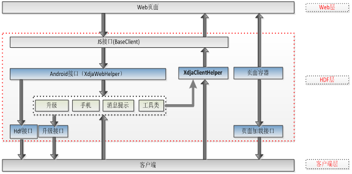

# Hybrid APP混合开发

## 定义

Hybrid App（混合模式移动应用）是指介于web-app、native-app这两者之间的app，兼具“Native App良好用户交互体验的优势”和“Web App跨平台开发的优势”。  

Hybrid App按网页语言与程序语言的混合，通常分为三种类型：多View混合型，单View混合型，Web主体型。  
### 多View混合型  
即Native View和Web View独立展示，交替出现。2012年常见的Hybrid App是Native View与WebView交替的场景出现。这种应用混合逻辑相对简单。即在需要的时候，将WebView当成一个独立的View（Activity）运行起来，在WebView内完成相关的展示操作。这种移动应用主体通常是Native App，Web技术只是起到补充作用。开发难度和Native App基本相当。  
### 单View混合型  
即在同一个View内，同时包括Native View和Web View。互相之间是覆盖（层叠）的关系。这种Hybrid App的开发成本较高，开发难度较大，但是体验较好。如百度搜索为代表的单View混合型移动应用，既可以实现充分的灵活性，又能实现较好的用户体验。  
### Web主体型  
即移动应用的主体是Web View，主要以网页语言编写，穿插Native功能的Hybrid App开发类型。这种类型开发的移动应用体验相对而言存在缺陷，但整体开发难度大幅降低，并且基本可以实现跨平台。Web主体型的移动应用用户体验的好坏，主要取决于底层中间件的交互与跨平台的能力。国外的appMobi、PhoneGap和国内的WeX5、AppCan和Rexsee都属于Web主体型移动应用中间件。其中Rexsee不支持跨平台开发。appMobi和PhoneGap除基础的底层能力更多是通过插件（Plugins）扩展的机制实现Hybrid。AppCan除了插件机制，还提供了大量的单View混合型的接口来完善和弥补Web主体型Hybrid App体验差的问题，接近Native App的体验。而WeX5则在揉合PhoneGap和Bootstrap等主流技术的基础上，对性能进一步做了深度优化，不但完全具备Native App对本地资源的调用能力，性能体验也不输原生；WeX5所开发出来的app具备完全的跨端运行能力，可以无需任何修改直接运行在各种前端环境上。  

从分析可见，Hybrid App中的Web主体型只要能够解决用户体验差的问题，就可以变成最佳Hybrid App解决方案类型。  
### 多主体共存型——灵活型  
这是一种新型的开发模式，即支持Web主体型的应用，又支持以Native主体的应用，也支持两者混合的开发模式。比如kerkee框架  ，它具有跨平台、用户体验好、性能高、扩展性好、灵活性强、易维护、规范化、具有Debug环境、彻底解决跨域问题等特点。用户体验与Native App媲美。功能方面，开发者可随意扩展接口。  

## 混合开发框架和层次结构图

1）移动终端web壳（以下简称“壳”）：壳是使用操作系统的 API 来创建嵌入式 HTML的渲染引擎。壳主要功能是定义 APP 应用程序与网页之间的接口，允许网页中的JavaScript调用 APP 应用程序，提供基于web的应用程序的 APP API，将Web嵌入到 APP 应用程序中。  

2）前端交互js：包括基础功能js和业务功能js。  

3）前端适配器：适配不同的终端：Pad、android、ios、wap。  

  
  
