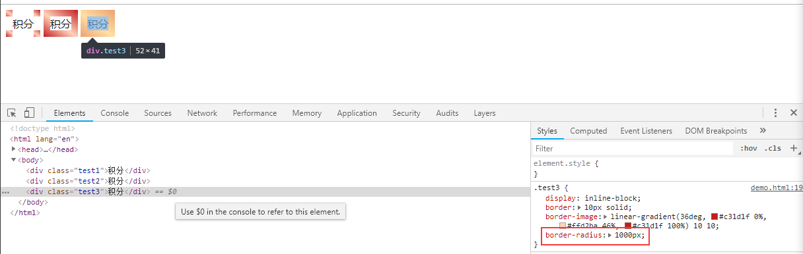

# 渐变圆角边框的实现探索

需求：实现如图所示的渐变圆角边框。  
咋一看，这个需求没啥问题。圆角嘛，`border-radius`轻松搞定。至于渐变，边框好像有个属性支持渐变，咱"百度"一波~  

## 面向百度编程
花了一分钟，我找到了一份实现方案：  
```CSS
  .box{
     width: 100px;
     height: 100px;
     border:10px solid #ddd;
     border-image: -webkit-linear-gradient(#ddd,#000) 30 30;
     border-image: -moz-linear-gradient(#ddd,#000) 30 30;
     border-image: linear-gradient(#ddd,#000) 30 30;
}
```
soga，原来是`border-image`属性支持渐变颜色，那我们照着实现一波。  
```html
<div class="test1">积分</div>
```
```CSS
    .test1 {
      display: inline-block;
      border: 10px solid;
      border-image: linear-gradient(36deg, #c31d1f 0%, #ffd2ba 46%, #c31d1f 100%) 30 30;
    }
```
效果嘛，如图：。emmm...还是很接近了嘛，渐变已经有了，不过这个效果...肯定是哪里打开方式不对，我们再看点专业的[border-image](https://developer.mozilla.org/zh-CN/docs/Web/CSS/border-image)。当然，这个有点太专业了，我们可以搭配点其他开发者的博客帮助理解。然后我们的样式调整为：  
```CSS
    .test2 {
      display: inline-block;
      border: 10px solid;
      border-image: linear-gradient(36deg, #c31d1f 0%, #ffd2ba 46%, #c31d1f 100%) 10 10;
    }
```
效果，如图：。  
现在我们离最终的结果已经很近了，近到已经只差一个圆角了，`border-radius: 1000px`走你...  
```CSS
    .test3 {
      display: inline-block;
      border: 10px solid;
      border-image: linear-gradient(36deg, #c31d1f 0%, #ffd2ba 46%, #c31d1f 100%) 10 10;
      border-radius: 1000px;
    }
```
效果，如图：。  
我去，这是放错了图吧，怎么把效果2放上来了！！！先别急，优秀的程序员都是讲道理的，我们先查看源码。不但代码没问题，而且在浏览器查看的时候`border-radius`还已经生效了！！！所以我的圆角被gou吃了嘛、、、  

## 我的圆角被gou吃了
在上面我们遇到了一个问题，一只拦在我们面前的“小脑斧”，我们设置了渐变边框，然后我们设置了圆角边框，然后我们的圆角就被gou吃了...很迷茫啊，该怎么办。  
一般遇到这种问题呢，要不就是再来一波“面向百度编程”，要么就是再钻研钻研规范，我选择了后者。  
所以我就反反复复的看啊，一遍一遍的读...终于，有个东西冒出来了：使用 `border-image` 时，其将会替换掉 `border-style` 属性所设置的边框样式。使用 `border-image` 时，其将会替换掉 `border-style` 属性所设置的边框样式。使用 `border-image` 时，其将会替换掉 `border-style` 属性所设置的边框样式。使用 `border-image` 时，其将会替换掉 `border-style` 属性所设置的边框样式。嗯，在心里默念三遍...  
所以说，不止“鱼和熊掌不可得兼”，“border-image和border-radius也不可得兼”。这也侧面反映了困恼广大程序员的另一个问题：在真正开发之前你永远都不会知道某个看起来很简单的需求会有多坑爹！！！  

## 需求还是要有的，万一实现了呢
现在我们很迷茫，有渐变边框就没有了圆角。让产品接受直角渐变边框？emmm...我觉得这个需求还能抢救一下。是时候祭出我们的神器了  
一顿操作猛如虎，发现遇到这种需求的开发还是有的，大家的实现方式基本一致-使用两个元素进行模拟，一个元素有渐变背景然后另一个元素将中间遮住，这样露出来的四边就成了边框了。  
思路有了，然后就是各种试探，步骤我就不列出来了，直接贴我实现的代码。  
```CSS
    .test4 {
      display: inline-block;
      background: inherit;
      position: relative;
      background: white;
      padding: .3em 1em;
      border-radius: 1000px;
    }
    .test4::after {
      content: '';
      position: absolute;
      top: -10px;
      right: -10px;
      bottom: -10px;
      left: -10px;
      border-radius: 1000px;
      z-index: -1;
      background: linear-gradient(36deg, #c31d1f 0%, #ffd2ba 46%, #c31d1f 100%);
    }
```
效果，如图：。  

## 总结
目前阶段，只是使用`border`系列属性是实现不了圆角渐变边框的，我们需要使用双层元素的背景来模拟实现边框。这种方案还有有些不太满意的地方-整体必须有一个背景，不能实现类似同时透出上一层的背景。当然，可能有更好的解决方案我暂时没有了解到，希望以后有同仁能够给我惊喜。  
