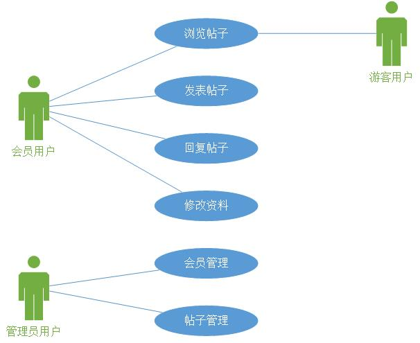

# egg 入坑

## egg 实战

在8月1日尝试将整个项目由首页入手，对照已有的 cnode 社区源码进行逐步组装的方案。经过尝试
发现很难进行解耦，而且逻辑也捋不清楚，很难进行下去。所以今天开始尝试另一个方案，尝试自己
搭建一个论坛系统，然后遇到不明白的地方再去看 cnode 社区的源码，希望这种方案能够最后产出
一个合格的论坛系统。  

### clone egg-cnode 并安装

* 使用 git clone egg-cnode  

* 安装依赖：redis、mongodb（已安装）  

#### 安装 redis  

### 功能设计

首先百度了一下论坛的设计应该怎么做（中文学习的快嘛，google 什么的学起来还是慢一点，而且
这种古老的问题应该用不上去 google）。然后找到了一篇[BBS论坛系统的设计与实现](https://wenku.baidu.com/view/56b49934657d27284b73f242336c1eb91a37330d.html)。  
发现应该先画个用例图，嗯，我也来画一个吧。  

**用例图**  
  

然后我们描述一下系统功能：  
**系统功能概述**  
* 用户功能的实现  
    * 登录  
    * 注册  
    * 修改资料  
* 帖子功能的实现  
    * 帖子发表  
    * 帖子分类展示  
    * 帖子回复  
    * 帖子查找  
* 后台管理的功能  
    * 帖子的管理（置顶、删除等）  
    * 论坛信息的管理（广告等）  